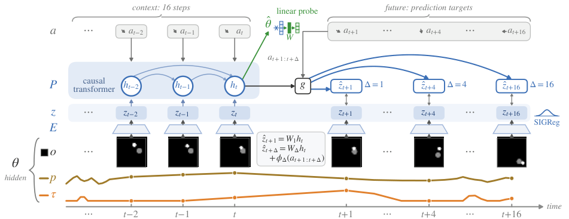
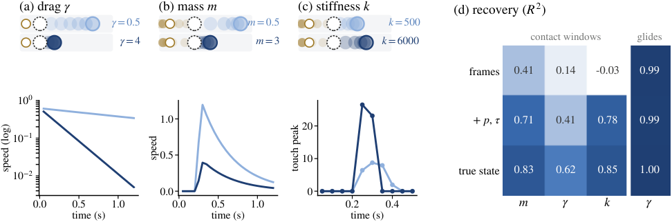

# What Can Latent World Models Know?

**Physical Information in Multimodal Predictive Representations**

**Kaizhen Tan<sup>1,4,&#42;</sup>, Sizhe Xu<sup>1,4,&#42;</sup>, Xin Xu<sup>2</sup>,
Siru Tao<sup>2</sup>, Yixiao Li<sup>2</sup>, Hanzhe Hong<sup>2</sup>,
Yang Feng<sup>3</sup>, Heqing Du<sup>3</sup>, Zhaonan Wang<sup>4</sup>**

<sup>1</sup>New York University · <sup>2</sup>Carnegie Mellon University ·
<sup>3</sup>Columbia University · <sup>4</sup>NYU Shanghai<br>
<sup>&#42;</sup>Equal contribution.

[](https://tantansir.github.io/latent-world-model-identifiability/)
[](docs/assets/paper.pdf)
[](https://arxiv.org/abs/2607.27017)
[](LICENSE)

We study which physical quantities are accessible in learned latent states,
how this depends on training, and how those quantities relate to future
predictions. Experiments use PokeWorld, a simulated pushing environment with
hidden mass, drag, and contact stiffness, and real multimodal robot data from RH20T.

The [paper PDF](docs/assets/paper.pdf) and
[project page](https://tantansir.github.io/latent-world-model-identifiability/)
reflect the current manuscript. The linked arXiv record currently contains an
earlier revision with the previous title and author list.



## Measurements and Findings

The study separates three measurements:

| Measurement | What is evaluated |
| --- | --- |
| Recovery from observations | A supervised two-layer GRU estimates physical parameters from observation and action windows. Its held-out performance provides an empirical recovery reference. |
| Latent readout | Probes estimate physical quantities from a frozen model's representations. Weak linear readout alone does not establish that all parameter information has been discarded. |
| Forecast dependence | Tests with prescribed actions measure how forecasts vary with a physical parameter and compare that response with the simulator. |

The recovery reference is the performance of a particular estimator, not an
information-theoretic upper bound.

- **Prediction targets affect parameter readout.** On contact windows, stiffness
  readout is −0.01 for VF, which receives touch but predicts only latent targets,
  and 0.50 for VFX, which also predicts touch (Table 1, mean R² over three seeds).
- **Longer horizons improve motion readout.** Position and velocity readout improve
  across all three observation and regularization settings in Table 2. For
  frame-plus-difference inputs at λ = 0.02, position R² increases from 0.67 to
  0.95 and velocity R² from 0.40 to 0.78.
- **Readout and forecast dependence can diverge.** On free glides, VFX forecasts
  shorten with increasing drag, with a slope ratio of 1.04 relative to the true
  dynamics. A coordinate-target model reads drag almost perfectly but forecasts
  displacement that increases with drag (Figure 3).
- **RH20T shows the same input–target dependence.** On held-out Flexiv tasks,
  VFX reaches current-force R² of 0.88 and future-force R² of 0.47. An untrained
  fused-input encoder already has current-force R² of 0.91; predicting force
  preserves this readout, while training VF reduces it below zero (Table 4).

Here, V uses visual input; F adds proprioception and touch or force to the input;
X adds prediction targets for those sensor streams. All variants predict latent
targets. The paper also separates proprioception-only and touch-only target
variants.



PokeWorld objects look identical while their physical parameters vary. The
[project page](https://tantansir.github.io/latent-world-model-identifiability/)
includes paired simulations, glide forecasts, and force traces from real robots.

## Code Release Scope

The release includes the current PokeWorld training and evaluation code from
Torch: corrected action alignment (`--acorr`), matched recovery references,
horizon controls, prescribed-action tests, and frozen-head diagnostics. It also
includes RH20T training with training-only sensor clipping and the common
future-force evaluation used in Tables 4 and 16.

We include 280 selected result JSON files used by the current main text and
appendix, plus two numerical exports for glide forecasts and intervention
statistics. Earlier results remain in `exp/`; the table below identifies the
current result families. Figures 1–4 and nine numerical tables can be regenerated
from the released scripts and results without trained checkpoints.

Raw and preprocessed datasets, replay arrays, and trained checkpoints are not
included. The simulator can generate new PokeWorld corpora, but its current and
previously released versions do not reproduce the archived training trajectories
bit for bit. Exact retraining of the saved runs therefore requires the archived
corpus as well as the training configuration. RH20T also requires the converted
dataset layout described below; the raw-to-LeRobot conversion is not included.
The original implementations are retained as `pokeworld_legacy.py` and
`train_legacy.py` for reference and compatibility with earlier experiments.

## Repository Layout

| Path | Contents |
| --- | --- |
| [`exp/e001_xmodal_jepa/`](exp/e001_xmodal_jepa/) | PokeWorld simulator, single-step models, training, and parameter probes |
| [`exp/e002_multiscale/`](exp/e002_multiscale/) | Multi-horizon prediction with Δ ∈ {1, 4, 16} |
| [`exp/e003_motion/`](exp/e003_motion/) | Corrected action alignment, horizon controls, matched recovery, interventions, frozen heads, and CEM planning |
| [`exp/e005_patchtok/`](exp/e005_patchtok/) | Patch-token architecture experiments |
| [`exp/e010_rh20t/`](exp/e010_rh20t/) | RH20T preprocessing, training, force evaluation, and cross-embodiment experiments |
| [`paper/figures/`](paper/figures/) | Current figure builders, LaTeX table generators, and numerical export scripts |
| [`docs/`](docs/) | Project website, current paper PDF, figures, and videos |

### Paper-to-Code Map

Result paths below are relative to `exp/e003_motion/results/`, except RH20T files,
which are under `exp/e010_rh20t/results/`. `s{0,1,2}` denotes the three training seeds.

| Paper results | Scripts | Saved results |
| --- | --- | --- |
| Figure 2: recovery references | `cert_matched.py`, `glide_recovery.py` | `cert_matched.json`, `glide_recovery.json` |
| Table 1: input and target variants | `train.py --acorr` | `{V,VF,VXp,VXt,VX,VFX}_s{0,1,2}_l0.02_ac.json` |
| Table 2: prediction horizons | `train.py --acorr`, with `--deltas`, `--extra1`, `--noproj`, `--nodiff`, and `--lam` controls | `V_s*_ac*` files, including `_D1` and `_D1_e1x{1,3}_np` suffixes |
| Figure 3: pure glides | `analyze_gamma.py`, `probe_targets.py` | `glide_forecasts.json`, recovery files, and the baseline/coordinate-target probe JSON |
| Table 3 and Tables 10–13: forecast dependence | `func_cf.py`, `func_nat.py`, `func_impact.py`, `train_heads.py` | `func_cf_*`, `func_nat_*`, `func_impact_*`, and `intervention_metrics.json` |
| Figure 4 and Table 14: frozen-head objectives | `effect_heads.py` | `effect_heads_VFX_*_s0.json` |
| Tables 6–9: probe and objective controls | `train.py` | Current `_ac` results, including `_sid`, `_nll`, `_rc`, `_tw*`, and regularization sweeps |
| RH20T Table 4 and Tables 15–16 | `train.py`, `rand_baseline.py`, `eval_futforce_fair.py` | `*_c1_tc*.json`, `futforce_fair_c1_tc*_strict_lab.json`, `RAND_c1.json` |
| RH20T Figure 5 and Table 17 | `train_legacy.py`, `paper/figures/make_qual.py` | Earlier `VFX_s0.pt` / `VFX_s0_c1.pt` checkpoints required for Figure 5; earlier result JSON retained |

The numerical exports preserve measurements from the original runs.
`intervention_metrics.json` contains 90 replay summaries, including action-effect
relative errors and drag release slope ratios. `glide_forecasts.json` contains
six model/seed records with binned forecasts, glide readouts, and slopes.

## Running the Released Code

### Environment

Clone the repository and run the commands below from its root:

```bash
git clone https://github.com/tantansir/latent-world-model-identifiability.git
cd latent-world-model-identifiability
```

The training scripts use CUDA and bfloat16 autocasting. Install a CUDA-enabled
[PyTorch build](https://pytorch.org/get-started/locally/) compatible with your GPU.
Core training and evaluation use NumPy and PyTorch.

```bash
python -m pip install numpy matplotlib
```

RH20T preprocessing additionally needs pandas, a Parquet engine, ImageIO, and PyAV:

```bash
python -m pip install pandas pyarrow imageio av
```

The release does not include a pinned environment specification.

### PokeWorld Data and Training

Generate the default 64-step episodes: 4,000 training, 400 validation, 1,600
probe-training, and 800 probe-test episodes. This writes image arrays and state
files under `exp/e001_xmodal_jepa/data/`.

```bash
python exp/e001_xmodal_jepa/pokeworld.py

# Table 1: repeat for V, VF, VXp, VXt, VX, VFX and seeds 0, 1, 2.
python exp/e003_motion/train.py --variant VFX --seed 0 --lam 0.02 --acorr

# Re-evaluate the checkpoint created by the preceding command.
python exp/e003_motion/train.py --variant VFX --seed 0 --lam 0.02 --acorr --eval_only

# Figure 2: supervised recovery references.
python exp/e003_motion/cert_matched.py
python exp/e003_motion/glide_recovery.py 778
python exp/e003_motion/glide_recovery.py 778 --only-v
```

`--acorr` starts the future-action window at the action following the last context
observation. It is required for the current PokeWorld experiments.

For Table 2, use the following four head settings with each seed. The example
uses frame-plus-difference input and λ = 0.02. Add `--nodiff` for grayscale input;
use `--lam 0.1 --nodiff` for the other grayscale setting.

```bash
python exp/e003_motion/train.py --variant V --seed 0 --lam 0.02 --acorr --deltas=
python exp/e003_motion/train.py --variant V --seed 0 --lam 0.02 --acorr --deltas= --extra1 1 --noproj
python exp/e003_motion/train.py --variant V --seed 0 --lam 0.02 --acorr --deltas= --extra1 3 --noproj
python exp/e003_motion/train.py --variant V --seed 0 --lam 0.02 --acorr
```

Training writes checkpoints (`.pt`) and evaluation summaries (`.json`) into each
experiment's `results/` directory. Reusing a variant/seed/configuration tag
overwrites its saved output. The older `run_e001.py` orchestrator skips variants
whose result JSON already exists, including the results committed here; use the
explicit training commands above to run a new experiment.

### Interventions and Frozen Heads

Train the baseline, coordinate-target, and true-parameter models of Table 3:

```bash
python exp/e003_motion/train.py --variant VFX --seed 0 --lam 0.02 --objin --acorr --ihead
python exp/e003_motion/train.py --variant VFX --seed 0 --lam 0.02 --vr --objin --kr --mr --acorr --ihead
python exp/e003_motion/train.py --variant VFX --seed 0 --lam 0.02 --oracle --objin --acorr --ihead
```

Repeat for seeds 1 and 2. For each checkpoint tag, evaluate mass push and drag
release (seed 780), natural continuation (780), and stiffness impact (781).
These commands use Bash environment-variable syntax:

```bash
TAG=VFX_s0_l0.02_oi_ac_ih
python exp/e003_motion/func_cf.py "$TAG" 780
CF_MODE=release python exp/e003_motion/func_cf.py "$TAG" 780
python exp/e003_motion/func_nat.py "$TAG" 780
python exp/e003_motion/func_impact.py "$TAG" 781

# Export statistics from the replay NPZ files generated above.
python paper/figures/summarize_interventions.py --stems "func_cf_${TAG}" "func_cf_${TAG}_release" --output replay_summary.json

# Figure 4: repeat for baseline and coordinate-target trunks, seeds 0–2.
python exp/e003_motion/effect_heads.py "$TAG"

# Appendix frozen-head comparisons; each command writes a separate head tag.
python exp/e003_motion/train_heads.py "$TAG"
python exp/e003_motion/train_heads.py "$TAG" --theta
python exp/e003_motion/train_heads.py "$TAG" --thetahat
python exp/e003_motion/train_heads.py "$TAG" --randproj
```

For Figure 3, run `analyze_gamma.py TAG 778` with `GLIDE_FRAC=1` and
`probe_targets.py TAG 778` for `VFX_s{0,1,2}_l0.02_ac` and
`VFX_s{0,1,2}_l0.02_vr_oi_kr_mr_ac_ih`. To export new runs, save stdout as
`gl_fc_<arm>_s<seed>.out` and `gl_rd_<arm>_s<seed>.out`, where `<arm>` is `ac`
or `vr_oi_kr_mr_ac_ih`, then run
`python paper/figures/export_glide_results.py --logs-dir /path/to/logs`.

### RH20T Preprocessing and Training

The study uses [RH20T](https://rh20t.github.io/) configurations 1 (Flexiv) and 7
(KUKA). The released `prep.py` expects a **converted LeRobot-style dataset**, with
`data/**/*.parquet`, `videos/<camera>/**/*.mp4`, and
`meta/rh20t_episodes.json`. The conversion from the original RH20T files is not
included in this repository.

For Flexiv, replace `/path/to/converted/cfg1` with that dataset directory:

```bash
python exp/e010_rh20t/prep.py observation.images.cam_035622060973 data_cfg1 /path/to/converted/cfg1
```

This creates `images.npy`, `sensors.npz`, and `index.npz` in
`exp/e010_rh20t/data_cfg1/`. Preprocessing must finish before training or evaluation,
because the training module reads these files when imported.

For the full-training-split results in Table 4:

```bash
for seed in 0 1 2; do
  for variant in V VX VF VFX; do
    E010_DATA=data_cfg1 E010_NEP= python exp/e010_rh20t/train.py --variant "$variant" --seed "$seed"
  done
  E010_DATA=data_cfg1 E010_NEP= E010_TAGSUF=_tc E010_SEED="$seed" E010_STRICT=1 E010_LABFIX=1 python exp/e010_rh20t/eval_futforce_fair.py
done
E010_DATA=data_cfg1 E010_NEP= python exp/e010_rh20t/rand_baseline.py
```

New training runs automatically add `_tc` to their tags. Sensor clipping uses
only the selected training episodes; whitening uses the first 200 selected
training episodes. For the 800-episode comparison, set `E010_NEP=800` for both
training and evaluation and also pass `--nep 800` to `train.py`. The future-force
table uses the `V:h`, `VX:h`, `VF:h`, and `VFX:h` outputs, with strict context
actions and common full-training-split label statistics.

In PowerShell, set environment variables with `$env:E010_DATA = "data_cfg1"`
and the same syntax for the other settings before running Python.

For KUKA, use camera `observation.images.cam_037522061512`, output directory
`data`, and set `E010_DATA=data`. The output JSON separates within-task (`iid`)
and held-out-task (`ood`) evaluations.

Figure 5 and the earlier force/onset results in Table 17 use
`train_legacy.py` and checkpoints without `_tc`. Their figure and video builders
explicitly import that implementation so the preprocessing stays consistent
with those checkpoints.

### Regenerating Figures and Tables

The following commands use the committed results and run without a GPU or
training data. Figure 1 generates an illustrative episode; Figure 2 replays
matched initial conditions and plots the saved recovery results.

```bash
python paper/figures/make_fig_overview.py
python paper/figures/make_fig_pokeworld.py
python paper/figures/make_fig_glide.py
python paper/figures/make_fig_effect.py
python paper/figures/gen_appendix.py
python paper/figures/gen_tabs.py
python paper/figures/gen_effect_tab.py
```

Figures are written beside their scripts. The table generators print LaTeX to
stdout: Table 2 and Tables 6–9, Tables 10–12, and Table 14, respectively. They
do not edit the manuscript. The current main tables can also be checked against
the per-seed JSON families in the paper-to-code map above.

Figure 5 requires CUDA, the RH20T data, and the earlier checkpoints. Generate
both robot panels with:

```bash
python paper/figures/make_qual.py kuka
python paper/figures/make_qual.py flexiv
```

Set `RH20T_ROOT` to the directory containing the converted `cfg1` and `cfg7`
datasets if it differs from `data_rh20t/`.

### Planning and Videos

The supplementary planning demonstration uses a separate VFX checkpoint with
λ = 0.005. Install the visualization dependencies first:

```bash
python -m pip install matplotlib imageio imageio-ffmpeg
python exp/e003_motion/train.py --variant VFX --seed 0 --lam 0.005
python exp/e003_motion/plan_eval.py VFX_s0_l0.005 viz
```

Existing videos are available on the project page. To regenerate the PokeWorld
paired simulations:

```bash
python docs/assets/make_pokeworld_videos.py
```

Planning and real-robot video builders under `docs/assets/` additionally require
the corresponding trajectories, prepared data, and checkpoints. Some older
orchestration and analysis scripts retain machine-specific paths; inspect those
paths before running them.

## Citation

The following entry describes the current manuscript linked above:

```bibtex
@misc{tan2026latentworldmodels,
  title         = {What Can Latent World Models Know? Physical Information
                   in Multimodal Predictive Representations},
  author        = {Tan, Kaizhen and Xu, Sizhe and Xu, Xin and Tao, Siru and
                   Li, Yixiao and Hong, Hanzhe and Feng, Yang and Du, Heqing
                   and Wang, Zhaonan},
  year          = {2026},
  url           = {https://tantansir.github.io/latent-world-model-identifiability/}
}
```

## License

Code is distributed under the [MIT license](LICENSE). RH20T data remains subject
to its own dataset terms.
